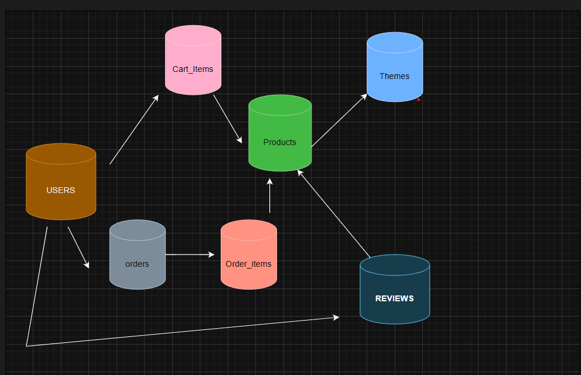

# Colorings Shop — REST API

An online store for coloring books and art supplies.

* **Core features:** product search & filters, cart, checkout, user registration/login, profile with order history.
* **Data format:** all requests and responses use **JSON**.
* **Auth:** JWT (Bearer) where required. Admin endpoints are marked with **(admin)**.

---

## Endpoints

### Products

**List products**

* **Method:** `GET`
* **Path:** `/products`
* **Purpose:** search, filter, sort, paginate products
* **Query params:**

  * `search` (string)
  * `theme` (id or slug)
  * `category` (id or slug)
  * `sort` (`name`, `price:asc`, `price:desc`)
  * `page` (default `1`), `limit` (default `20`)
* **Response `200`:**

```json
{
  "data": [ /* products */ ],
  "meta": { "page": 1, "limit": 20, "total": 123 }
}
```

**Get product by id**

* **Method:** `GET`
* **Path:** `/products/{id}`
* **Response `200`:**

```json
{ "id": 1, "name": "Forest Coloring Book", "price": 9.99, "currency": "USD",
  "sku": "CB-001", "theme": "nature", "category": "books",
  "images": [], "description": "..." }
```

**Create product** **(admin)**

* **Method:** `POST`
* **Path:** `/products`
* **Body:**

```json
{ "name": "Pencils Set", "price": 7.50, "currency": "USD",
  "category": "supplies", "theme": "basics", "sku": "PS-012", "description": "..." }
```

* **Response `201`:** `{ "id": 42, ... }`

**Update product** **(admin)**

* **Method:** `PUT`
* **Path:** `/products/{id}`
* **Body:** `{ /* any product fields */ }`
* **Response `200`:** `{ "id": 42, ... }`

**Delete product** **(admin)**

* **Method:** `DELETE`
* **Path:** `/products/{id}`
* **Response `204`** (no body)

---

### Themes

**List themes**

* **Method:** `GET`
* **Path:** `/themes`
* **Response `200`:**

```json
[ { "id": 1, "name": "Animals", "slug": "animals" } ]
```

**Products by theme**

* **Method:** `GET`
* **Path:** `/themes/{id}/products`
* **Response `200`:**

```json
{ "data": [ /* products */ ], "meta": { "page": 1, "limit": 20, "total": 5 } }
```

**Create theme** **(admin)**

* **Method:** `POST`
* **Path:** `/themes`
* **Body:** `{ "name": "Fantasy" }`
* **Response `201`:** `{ "id": 7, "name": "Fantasy", "slug": "fantasy" }`

---

### Auth & Users

**Register**

* **Method:** `POST`
* **Path:** `/auth/register`
* **Body:** `{ "username": "daria", "email": "d@ex.com", "password": "..." }`
* **Response `201`:** `{ "id": 10, "username": "daria", "email": "d@ex.com" }`

**Login**

* **Method:** `POST`
* **Path:** `/auth/login`
* **Body:** `{ "email": "d@ex.com", "password": "..." }`
* **Response `200`:**

```json
{ "token": "jwt-token", "user": { "id": 10, "username": "daria" } }
```

**Get profile** (self or admin)

* **Method:** `GET`
* **Path:** `/users/{id}`
* **Headers:** `Authorization: Bearer <token>`
* **Response `200`:** `{ "id": 10, "username": "daria", "email": "d@ex.com", "createdAt": "..." }`

**Update profile** (self or admin)

* **Method:** `PUT`
* **Path:** `/users/{id}`
* **Body:** `{ "username"?: "...", "email"?: "...", "password"?: "..." }`
* **Response `200`:** `{ "id": 10, ... }`

**Order history**

* **Method:** `GET`
* **Path:** `/users/{id}/orders`
* **Response `200`:**

```json
[ { "orderId": 101, "total": 39.97, "currency": "USD", "status": "paid", "createdAt": "..." } ]
```

---

### Cart

**View cart**

* **Method:** `GET`
* **Path:** `/cart`
* **Response `200`:**

```json
[ { "itemId": 1, "productId": 42, "name": "Pencils Set", "price": 7.50, "qty": 2, "subtotal": 15.00 } ]
```

**Add to cart**

* **Method:** `POST`
* **Path:** `/cart`
* **Body:** `{ "productId": 42, "quantity": 2 }`
* **Response `201`:** `{ "itemId": 1, "productId": 42, "qty": 2 }`

**Change quantity**

* **Method:** `PUT`
* **Path:** `/cart/{itemId}`
* **Body:** `{ "quantity": 3 }`
* **Response `200`:** `{ "itemId": 1, "qty": 3 }`

**Remove item**

* **Method:** `DELETE`
* **Path:** `/cart/{itemId}`
* **Response `204`**

**Checkout**

* **Method:** `POST`
* **Path:** `/cart/checkout`
* **Headers (optional):** `Authorization: Bearer <token>`
* **Response `201`:**

```json
{ "orderId": 101, "total": 39.97, "currency": "USD", "status": "placed" }
```

---

### Orders

**Get order details** (owner or admin)

* **Method:** `GET`
* **Path:** `/orders/{id}`
* **Response `200`:**

```json
{
  "orderId": 101,
  "items": [
    { "productId": 42, "name": "Pencils Set", "unit_price": 7.50, "qty": 2, "line_total": 15.00 }
  ],
  "total": 39.97,
  "currency": "USD",
  "status": "paid"
}
```

---

### Static

**About**

* **Method:** `GET`
* **Path:** `/about`
* **Response `200`:** `{ "title": "About Us", "content": "..." }`

**Contacts / Delivery / Returns**

* **Method:** `GET`
* **Path:** `/contacts`
* **Response `200`:**

```json
{ "email": "hello@shop.com", "phone": "+123456789", "delivery": "...", "returns": "..." }
```

---

### Conventions

* **Pagination defaults:** `page=1`, `limit=20`
* **Sorting:** `sort=name` or `sort=price:asc|price:desc`
* **Errors:** JSON errors use

```json
{ "error": { "code": "BadRequest", "message": "Details..." } }
```

with HTTP statuses `400, 401, 403, 404, 422, 500`.

---

##  Database Schema (ERD)

Core entities:
`users`, `products`, `themes`,
`carts`, `cart_items`, `orders`, `order_items`,
`reviews` (optional moderation), `payments` (optional).


